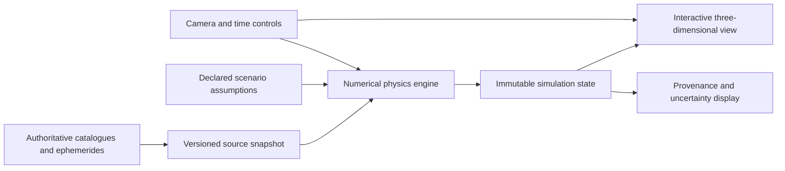
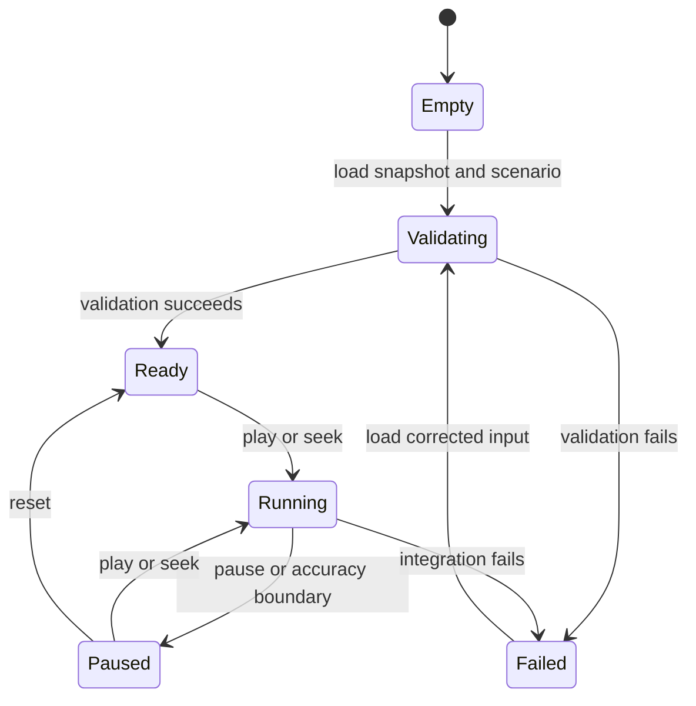

# Solar System Time Explorer Functional Specification

**Status**: Implemented baseline and target specification

**Author**: Laurence Hook

**Date**: 2026-08-06

**Version**: 2.3.0

**Companion files**: `solar-system-time-explorer-test-matrix.md` | `solar-system-time-explorer-changelog.md`

---

## 1. Executive Summary (informative)

This specification defines a physics-driven, interactive, three-dimensional Solar System time explorer for curious members of the public, students, educators, and advanced users.
The application covers present-day and historical ephemerides, numerical propagation, observational viewpoints, known natural and artificial bodies, and scientifically bounded deep-time scenarios.
The application distinguishes measured data, numerical prediction, and model-dependent reconstruction at every point where confusing those regimes could create false certainty.
Implemented requirements are identified by executable evidence in the companion matrix, while unimplemented target requirements remain Pending.

## 2. Conventions (normative)

The key words "MUST", "MUST NOT", "REQUIRED", "SHALL", "SHALL NOT", "SHOULD", "SHOULD NOT", "RECOMMENDED", "MAY", and "OPTIONAL" in this document are interpreted as described in [BCP 14](https://www.rfc-editor.org/info/bcp14), [RFC 2119](https://www.rfc-editor.org/rfc/rfc2119), and [RFC 8174](https://www.rfc-editor.org/rfc/rfc8174) only when they appear in capital letters.

All requirements follow Easy Approach to Requirements Syntax patterns.

### 2.1 Notation (informative)

- `monospace` denotes literal identifiers, units, fields, or values.
- International System of Units are called SI units.
- Barycentric Dynamical Time is abbreviated TDB.
- Coordinated Universal Time is abbreviated UTC.

## 3. Design Principles (normative)

- **REQ-001**: The application MUST derive authoritative simulated positions and velocities from a declared numerical physics model rather than scripted animation paths.
- **REQ-002**: The application MUST identify every displayed state as measured, numerically propagated, or model-dependent reconstruction.
- **REQ-003**: The application MUST preserve source values and units without substituting defaults for missing mass, radius, orbit, epoch, covariance, or classification data.
- **REQ-004**: WHEN a displayed scale differs from physical scale, the application SHALL display the active scale transformation continuously.
- **REQ-005**: The application SHALL make every simulation reproducible from a versioned source snapshot, initial state, force model, integrator configuration, and random seed where randomness is present.
- **REQ-006**: The rendering subsystem SHALL consume physics state without mutating the physics state.

## 4. System Overview (informative)

The application combines authoritative catalogue snapshots, ephemeris initial conditions, a numerical physics engine, scientific scenario definitions, and a three-dimensional explorer.
The initial engine boundary uses [REBOUND](https://rebound.hanno-rein.de/), which provides high-accuracy and symplectic N-body integrators.
[REBOUNDx](https://reboundx.readthedocs.io/) supplies explicitly enabled additional physical effects.
The publishable client uses strict TypeScript, React, and Three.js.
REBOUND 5.0.0 is compiled from its included GPL-3.0 C source into WebAssembly and executes in a Web Worker so numerical integration cannot block user-interface input.

### 4.1 Logical architecture (informative)

### 4.2 Data authorities (informative)

| Domain                                    | Initial authority                                                                               | Purpose                                                             |
| ----------------------------------------- | ----------------------------------------------------------------------------------------------- | ------------------------------------------------------------------- |
| Planets, satellites, and major-body state | [JPL Horizons](https://ssd-api.jpl.nasa.gov/doc/horizons.html)                                  | Initial Cartesian states and validation ephemerides                 |
| Asteroids and comets                      | [JPL Small-Body Database Query API](https://ssd-api.jpl.nasa.gov/doc/sbdb_query.html)           | Complete discoverable small-body catalogue and orbital solutions    |
| High-precision kernels                    | [JPL Solar System ephemerides](https://ssd.jpl.nasa.gov/ephem.html)                             | Reference states for supported epochs                               |
| Solar evolution                           | [NASA Sun facts](https://science.nasa.gov/sun/facts/)                                           | Public reference for the Sun's red-giant and white-dwarf stages     |
| Extra forces                              | [REBOUNDx effects](https://reboundx.readthedocs.io/)                                            | Relativity, radiation, migration, tides, and declared custom forces |
| Earth-orbiting spacecraft                 | [CelesTrak GP data](https://celestrak.org/NORAD/elements/gp.php?CATNR=25544&FORMAT=JSON-PRETTY) | Current OMM elements for SGP4 propagation                           |

### 4.3 Actors (informative)

| Actor                | Description                                                            |
| -------------------- | ---------------------------------------------------------------------- |
| Explorer             | Navigates space, time, objects, events, and scientific layers          |
| Educator             | Runs guided journeys and explains physical regimes                     |
| Scientific reviewer  | Examines provenance, assumptions, integrator settings, and uncertainty |
| Catalogue maintainer | Refreshes and verifies authoritative source snapshots                  |

## 5. Out of Scope (normative)

- **REQ-007**: The application SHALL NOT present deep-time reconstruction as a unique historical or future trajectory.
- **REQ-008**: The application SHALL NOT predict undiscovered astronomical objects.
- **REQ-009**: The application SHALL NOT invent photorealistic surface detail where authoritative imagery or shape data is absent.
- **REQ-010**: The application SHALL NOT present hypothetical impact experiments as operational impact-risk assessments.

### 5.1 Scope boundaries (informative)

The first release does not simulate general fluid dynamics inside stars or planets, biological evolution, climate evolution, or relativistic spacetime near compact objects.
These boundaries do not prevent scientifically sourced visual layers that are clearly separated from the N-body state.

## 6. Assumptions and Constraints (normative)

- **REQ-011**: The catalogue completeness claim SHALL be bounded to the named authority and source snapshot timestamp.
- **REQ-012**: WHERE a body's mass is negligible relative to active gravitating bodies, the application SHALL identify the body as a massless test particle in the selected model.
- **REQ-013**: WHERE an additional force is enabled, the application SHALL identify the force, parameters, source, and affected bodies.
- **REQ-014**: WHEN the requested object count exceeds the active solver capacity, the application SHALL preserve scientific behavior through declared level-of-detail simulation rather than dropping bodies without disclosure.

### 6.1 Assumptions register (informative)

| ID      | Assumption                                                                              | Impact if false                                                             |
| ------- | --------------------------------------------------------------------------------------- | --------------------------------------------------------------------------- |
| ASM-001 | JPL source services or downloadable snapshots remain available                          | Catalogue refresh and ephemeris updates require a replacement authority     |
| ASM-002 | Most minor bodies can be treated as massless test particles for interactive exploration | More bodies require active mass and substantially higher computational cost |
| ASM-003 | The client device supports hardware-accelerated three-dimensional graphics              | The application uses a reduced accessible presentation                      |
| ASM-004 | Deep-time scenarios have published initial conditions and physical assumptions          | The scenario remains unavailable rather than being improvised               |

## 7. Data Models (normative)

### 7.1 Catalogue object (normative)

| Field              | Type                        | Required | Constraint                         |
| ------------------ | --------------------------- | -------- | ---------------------------------- |
| `object_id`        | String                      | Yes      | Stable within an authority         |
| `object_class`     | Enum                        | Yes      | Controlled classification          |
| `names`            | String list                 | Yes      | May contain only a designation     |
| `mass_kg`          | Number or unknown           | Yes      | Non-negative when known            |
| `radius_m`         | Number or unknown           | Yes      | Positive when known                |
| `source_epoch_tdb` | Number or unknown           | Yes      | Julian date when known             |
| `state_vector`     | Cartesian state or unknown  | Yes      | SI units when known                |
| `orbital_solution` | Orbital elements or unknown | Yes      | Includes reference frame and epoch |
| `uncertainty`      | Covariance or unknown       | Yes      | Includes representation and units  |
| `provenance`       | Provenance record           | Yes      | At least one source record         |

- **REQ-015**: Every catalogue object SHALL have a stable authority-qualified identifier.
- **REQ-016**: Every catalogue object SHALL distinguish an unknown value from a measured zero.
- **REQ-017**: Every state vector SHALL declare coordinate frame, origin, time scale, epoch, position units, and velocity units.
- **REQ-018**: Every orbital solution SHALL declare the solution identifier and validity information supplied by its authority.

### 7.2 Simulation state (normative)

| Field             | Type            | Required | Constraint                                 |
| ----------------- | --------------- | -------- | ------------------------------------------ |
| `simulation_id`   | String          | Yes      | Unique for a reproducible run              |
| `epoch_tdb`       | Number          | Yes      | Source epoch                               |
| `elapsed_seconds` | Number          | Yes      | Signed finite value                        |
| `integrator`      | String          | Yes      | Versioned engine and method                |
| `force_model`     | Force list      | Yes      | Empty list is explicit Newtonian-only mode |
| `bodies`          | Body-state list | Yes      | At least one massive body                  |
| `regime`          | Enum            | Yes      | Measured, propagated, or reconstructed     |

- **REQ-019**: The simulation state SHALL store time as signed seconds relative to an explicit TDB epoch.
- **REQ-020**: The simulation state SHALL preserve double-precision Cartesian state for every active simulated body.
- **REQ-021**: The simulation state SHALL record active gravitating-body count separately from test-particle count.

## 8. Interface Specifications (normative)

### 8.1 Catalogue snapshot interface (normative)

The catalogue snapshot interface accepts an authority, snapshot identifier, retrieval timestamp, schema version, object records, and source checksums.

- **REQ-022**: WHEN a catalogue snapshot is loaded, the application SHALL validate its schema version, checksums, object counts, required fields, and authority metadata before activation.
- **REQ-023**: WHEN a new catalogue snapshot passes validation, the application SHALL activate the complete snapshot atomically.

### 8.2 Physics state interface (normative)

The physics state interface accepts complete initial Cartesian states, integration target time, integrator settings, collision policy, and additional-force settings.

- **REQ-024**: WHEN the physics engine receives incomplete required initial state, the physics engine SHALL reject the simulation before the first integration step.
- **REQ-025**: WHEN the physics engine advances time, the physics engine SHALL return a new timestamped state containing every active body or an explicit failure.

### 8.3 View-state interface (normative)

The view-state interface contains camera frame, camera transform, selected object, scale mode, visible layers, simulation identifier, and simulation timestamp.

- **REQ-026**: WHEN a view state is exported and restored against the same source snapshot, the application SHALL reproduce the selected simulation time, camera, object selection, scale mode, and visible layers.

## 9. Core Functional Requirements (normative)

### 9.1 Catalogue coverage (normative)

- **REQ-027**: The application SHALL include the Sun, every Solar System planet, and every dwarf planet recognized by the configured authority.
- **REQ-028**: The application SHALL include every natural satellite present in the configured planetary-satellite and small-body-satellite authority snapshots.
- **REQ-029**: The application SHALL include every asteroid and comet returned by the complete configured small-body catalogue snapshot.
- **REQ-030**: The application SHALL preserve unnamed and provisionally designated objects as searchable catalogue entries.
- **REQ-031**: WHEN an authority removes, merges, or reclassifies an object, the next snapshot SHALL preserve an auditable mapping from the preceding snapshot where the authority supplies one.
- **REQ-032**: The application SHALL display catalogue counts grouped by authority, class, snapshot time, and simulation eligibility.
- **REQ-033**: WHEN an object lacks an integrable orbit or state vector, the application SHALL retain the catalogue record and mark the object unavailable for simulation.
- **REQ-034**: WHEN a user searches by an accepted name, designation, or authority identifier, the application SHALL return every exact match before partial matches.

### 9.2 Physics-driven rendering (normative)

- **REQ-035**: WHEN simulation time changes, the renderer SHALL obtain body transforms from the physics state for that simulation time.
- **REQ-036**: The renderer SHALL NOT use decorative orbit paths as body trajectories.
- **REQ-037**: WHERE visual interpolation occurs between completed physics steps, the renderer SHALL bound interpolation to the two adjacent physics states and SHALL NOT commit the interpolated state as simulation state.
- **REQ-038**: WHERE true-scale mode is active, the renderer SHALL apply one common physical length scale to body radii and spatial separation.
- **REQ-039**: WHERE visible-scale mode is active, the renderer SHALL identify every nonphysical radius or distance transformation.
- **REQ-040**: WHERE authoritative texture or shape data exists, the renderer SHALL associate the asset with source and acquisition metadata.
- **REQ-041**: WHERE authoritative surface data is absent, the renderer SHALL use a visibly neutral representation labelled as unknown or approximate.
- **REQ-042**: WHERE a nonphysical locator view is active, WHEN a minor body is below the resolvable pixel size, the renderer SHALL preserve its position through a point or density representation without implying a measured radius.

### 9.3 Navigation and viewpoints (normative)

- **REQ-043**: The explorer SHALL support free translation and rotation in three spatial dimensions.
- **REQ-044**: WHEN a user selects a simulated object, the explorer SHALL provide focus, follow, orbit, and surface-relative views where the object's known radius permits them.
- **REQ-045**: The explorer SHALL provide heliocentric, barycentric, body-centred, and observer-sky coordinate frames.
- **REQ-046**: WHEN a user changes coordinate frame, the explorer SHALL preserve the simulation timestamp and selected object.
- **REQ-047**: WHEN a camera journey spans more than six orders of magnitude in distance, the explorer SHALL provide a continuous logarithmic transition without clipping the origin or destination.
- **REQ-048**: WHEN a user interrupts an automated camera transition, the explorer SHALL immediately return camera control without changing simulation time.
- **REQ-049**: The explorer SHALL display the active observer location, coordinate frame, distance scale, and selected object.

### 9.4 Time control and numerical integration (normative)

- **REQ-050**: The explorer SHALL support paused, forward, and backward simulation time.
- **REQ-051**: The explorer SHALL accept an exact target date and time for every date representable by the selected scenario.
- **REQ-052**: The explorer SHALL provide logarithmic time-rate control spanning sub-second inspection through the selected scenario's maximum rate.
- **REQ-053**: WHEN the requested time rate exceeds the physics engine's verified real-time capacity, the explorer SHALL reduce visual update frequency without skipping required integration work.
- **REQ-054**: WHEN a user returns to a previously computed time from the same initial state and configuration, the physics engine SHALL reproduce state within the integrator's declared error bounds.
- **REQ-055**: The explorer SHALL display simulation time, source epoch, elapsed duration, direction, time rate, integrator, and regime.
- **REQ-056**: WHEN a close encounter or collision violates the selected integrator's configured accuracy bound, the physics engine SHALL pause or switch through a predeclared policy rather than continue silently.
- **REQ-057**: WHERE test particles are enabled, the physics engine SHALL integrate their response to active gravitating bodies without allowing zero-mass particles to perturb active bodies.
- **REQ-058**: WHEN active-body membership or force-model configuration changes, the physics engine SHALL create a new simulation identity rather than mutate the provenance of the current run.

### 9.5 Historical, predictive, and deep-time regimes (normative)

- **REQ-059**: WHERE an authoritative ephemeris covers the selected object and time, the application SHALL permit comparison between integrated state and the authoritative reference state.
- **REQ-060**: WHEN the selected time lies outside an object's authoritative ephemeris validity, the application SHALL stop labelling the object's state as measured.
- **REQ-061**: WHERE orbital covariance is available, the application SHALL propagate and display positional uncertainty using a declared uncertainty method.
- **REQ-062**: WHERE a Solar System formation scenario is selected, the application SHALL initialize the simulation from a cited published scenario rather than extrapolate current states backward into formation.
- **REQ-063**: WHERE a solar-evolution scenario is selected, the force model SHALL apply a cited time-dependent solar mass and radius model that includes red-giant and white-dwarf stages.
- **REQ-064**: WHERE deep-time results are displayed, the application SHALL show scenario assumptions and SHALL NOT label individual minor-body positions as uniquely predicted.

### 9.6 Exploration layers and guided experiences (normative)

- **REQ-065**: The event finder SHALL identify eclipses, transits, occultations, conjunctions, close approaches, perihelia, and aphelia from simulated geometry.
- **REQ-066**: WHEN a user opens an event result, the explorer SHALL reproduce the event simulation, timestamp, viewpoint, participating objects, and uncertainty status.
- **REQ-067**: WHERE mission trajectory data is available, the explorer SHALL integrate or replay the trajectory in its declared reference frame and identify whether the state is integrated, kernel-derived, or reconstructed.
- **REQ-068**: WHERE gravity overlays are enabled, the explorer SHALL display barycentres, Hill spheres, Lagrange regions, orbital velocity, and escape velocity only where the selected model defines them.
- **REQ-069**: WHERE population layers are enabled, the explorer SHALL group objects by authoritative dynamical or catalogue classes without changing simulated state.
- **REQ-070**: WHERE light-time mode is enabled, the observer view SHALL display photons arriving at the observer time rather than simultaneous coordinate-time positions.
- **REQ-071**: WHERE discovery-time mode is enabled, the explorer SHALL hide an object before its recorded discovery time while preserving the underlying simulation.
- **REQ-072**: WHERE comparison mode is enabled, the explorer SHALL show selected bodies at one declared radius scale with directly comparable diameter, mass, surface gravity, rotation period, and escape velocity values when known.
- **REQ-073**: WHERE sonification is enabled, the application SHALL map declared physical quantities to sound and identify the mapping as data sonification rather than sound travelling through space.
- **REQ-074**: WHERE an impact experiment is enabled, the application SHALL create a separate hypothetical simulation with explicit changed initial conditions.
- **REQ-075**: WHERE a guided journey is active, the journey SHALL control camera and time through ordinary application actions without replacing physics-engine state.

### 9.7 Artificial satellites (normative)

- **REQ-110**: WHEN the International Space Station snapshot is loaded, the application SHALL validate the authority, retrieval time, epoch, reference frame, time scale, propagator, orbital elements, physical dimensions, and validity window before publishing an International Space Station state.
- **REQ-111**: WHEN the application calculates an International Space Station state, the application SHALL propagate the installed Orbit Mean-Elements Message with Simplified General Perturbations 4 at the corresponding Coordinated Universal Time.
- **REQ-112**: WHEN the renderer combines the International Space Station state with the Solar System state, the renderer SHALL transform the True Equator Mean Equinox state into the J2000 mean-equator frame before adding the Earth barycentric state.
- **REQ-113**: The International Space Station state SHALL have zero gravitational parameter in the active Solar System model.
- **REQ-114**: WHEN a user selects the International Space Station outside its installed validity window, the application SHALL seek simulation time to the installed Orbit Mean-Elements Message epoch.
- **REQ-115**: WHILE simulation time is more than seven days from the installed Orbit Mean-Elements Message epoch, the renderer SHALL hide all International Space Station geometry and locator markers.
- **REQ-116**: The International Space Station model SHALL preserve the NASA-sourced 109 metre maximum end-to-end dimension and 73 metre solar-array dimension on the same length scale as its separation from Earth.
- **REQ-117**: WHEN the International Space Station physical diameter projects below one Cascading Style Sheets pixel, the renderer SHALL NOT draw International Space Station geometry.
- **REQ-118**: The application SHALL provide an independent keyboard-operable Spacecraft visibility control.
- **REQ-119**: WHEN the International Space Station is selected, the application SHALL display its geocentric distance, altitude, relative speed, physical dimensions, orbital-data status, and model provenance as text.

### 9.8 Newtonian gravitational potential (normative)

- **REQ-120**: WHERE the gravity field is enabled, the renderer SHALL evaluate the combined Newtonian specific potential as the negative sum of each included body's gravitational parameter divided by distance from the sample point.
- **REQ-121**: WHERE the gravity field is enabled, the renderer SHALL include every current simulation body with a positive gravitational parameter.
- **REQ-122**: WHERE the gravity field is enabled, the renderer SHALL exclude every massless test-particle, catalogue, and artificial-satellite state from potential sources.
- **REQ-123**: WHEN a gravity-field sample lies inside a source body's sourced mean radius, the renderer SHALL evaluate the point-mass potential at the sourced mean-radius surface.
- **REQ-124**: WHEN simulation time or active-body position changes, the gravity field SHALL update from the corresponding displayed simulation state.
- **REQ-125**: The application SHALL provide keyboard-operable Off, Potential contours, and 3D potential surface gravity-field modes.
- **REQ-126**: WHERE a gravity field is visible, the application SHALL display the represented negative-potential range in joules per kilogram and identify the display as logarithmically transformed.
- **REQ-127**: WHERE 3D potential surface mode is enabled, the renderer SHALL apply visual displacement without changing simulation positions, velocities, gravitational parameters, or integration state.

### 9.9 Authority surface presentation (normative)

- **REQ-128**: The renderer SHALL source every installed major-body image from an explicit NASA, JPL, or USGS asset URL and record its checksum, source dimensions, output dimensions, projection, coverage, credit, classification, and limitations.
- **REQ-129**: The renderer SHALL provide an explicit visual representation for every installed non-stellar major body without treating an unavailable solid surface as measured imagery.
- **REQ-130**: WHERE no complete authoritative global surface or atmospheric mosaic exists, the renderer SHALL use a provenance-labelled observation-constrained material rather than inventing terrain detail.
- **REQ-131**: WHEN the 3D potential surface is enabled, the renderer SHALL cap visual well depth at 3.2 percent of field extent so the energy landscape remains visually anchored to the orbital slice.

### 9.10 Camera framing and visual hierarchy (normative)

- **REQ-132**: WHEN a user focuses a major body, the camera SHALL fit that body's displayed visual extent rather than silently substituting a wider planetary-system frame.
- **REQ-133**: WHEN a guided-tour step is presented, the step SHALL specify its camera distance, orientation, view mode, body-size treatment, and visible overlay set.
- **REQ-134**: WHERE a guided-tour step enables a line overlay, the tour card SHALL identify what the line represents.
- **REQ-135**: WHEN Reality first loads, planet trails, Moon trails, orbit guides, the tactical overlay, the ecliptic grid, and the gravity field SHALL be off.
- **REQ-136**: The three-dimensional scene SHALL render body and wayfinder labels as compact screen-space annotations and SHALL use collision bounds corresponding to their rendered dimensions; single activation of rendered body geometry or a label SHALL select the body without moving the camera; an explicit Focus action and double activation SHALL focus and fit the selected body.
- **REQ-137**: WHEN a guided-tour scene changes, the camera SHALL depart from the current subject, traverse the smallest authored overview at a stable readable scale, and settle into the next shot before automatic advancement; an observer scene SHALL route around its declared observer origin independently of the remote body it looks toward.
- **REQ-138**: WHEN the operating system requests reduced motion, the guided tour SHALL apply its authored shot without an animated camera transition.
- **REQ-139**: The renderer SHALL present the Sun with a granular photosphere, subtle chromosphere rim, and restrained diffuse corona and SHALL NOT invent a time-specific prominence or flare without corresponding observational data.
- **REQ-140**: The guided tour SHALL use varied three-dimensional compositions and SHALL place ordinary close planetary cameras toward the Sun-facing hemisphere rather than arbitrarily presenting the dark side.
- **REQ-141**: WHEN a guided-tour scene is active, the simulation clock SHALL run forward at the scene's authored supported time rate so the relevant rotation or orbital motion remains visible and legible.
- **REQ-142**: WHEN a user pauses, exits, or interrupts the guided tour, the application SHALL pause the simulation clock without discarding the current physics state.
- **REQ-143**: WHERE a guided-tour scene declares an observer body, the application SHALL commit the observer and target as one matching pair, SHALL keep the observer as the selected view origin for breadcrumbs, statistics, transition framing, and Sun distance, SHALL place the camera above the observer body's physical reference radius toward the target, and SHALL keep the target centred while both bodies follow their current physics positions.
- **REQ-144**: WHERE an observer scene uses optical zoom or presents a physically sub-pixel target, the tour card SHALL disclose the optical transformation and resolution limit without enlarging the body.
- **REQ-145**: WHERE an observer scene is not a surface-and-atmosphere reconstruction, the tour card SHALL identify it as a clear-space viewpoint rather than implying a literal surface view.
- **REQ-146**: WHEN a focus body is selected, the scene SHALL continuously display an interactive Sun label, the current focus-to-Sun distance derived from the rendered physics state, and a bearing line clipped to an unobstructed viewport boundary when the Sun is outside or behind the camera view.
- **REQ-147**: WHEN an automated camera journey runs while simulation time advances, the destination camera SHALL follow the current physics state and SHALL NOT snap to a stale endpoint when the journey settles.
- **REQ-148**: WHEN manual navigation crosses between bodies, the camera SHALL derive the overview scale from their current physical separation; WHEN an authored tour scene changes, its declared overview scale SHALL take precedence.
- **REQ-149**: Voyager 1 and Voyager 2 SHALL be initialized from NASA/JPL Horizons barycentric ICRF state vectors at the common major-body epoch and SHALL be propagated by REBOUND as zero-gravitational-parameter test particles.
- **REQ-150**: WHEN a Voyager probe is selected, the renderer SHALL use physical spacecraft dimensions, orient the high-gain antenna boresight toward the live Earth position, expose its distance and speed relative to the Sun, identify the state-vector and propagation provenance, and allow the Spacecraft control to hide it.
- **REQ-151**: The Focus control SHALL provide keyboard-operable grouped search across every installed overview, star, planet, major body, moon, and spacecraft target; opening the control SHALL show the complete catalogue regardless of the current selection or previous search, and typing SHALL filter that catalogue.
- **REQ-152**: The camera SHALL provide logarithmic optical zoom from 1/64x through 128x and SHALL derive the default close-spacecraft framing from the selected object's sourced physical maximum dimension.
- **REQ-153**: The ISS, Voyager probes, Hubble, and JWST SHALL use checksummed official NASA 3D models normalized to sourced physical dimensions, and a model-loading failure SHALL be visible rather than replaced by procedural geometry.
- **REQ-154**: Hubble and JWST SHALL use NASA/JPL Horizons barycentric ICRF position and velocity samples with cubic Hermite interpolation only inside each installed coverage window and SHALL NOT clamp or extrapolate beyond that window.
- **REQ-155**: The gravity-field presentation SHALL provide both a selected-field local-detail scale and a fixed Sun-referenced absolute-comparison scale, and SHALL label which scale is active.
- **REQ-156**: Atmosphere scattering SHALL depend on both view direction and the live Sun direction so the renderer does not apply a false illuminated rim to the night hemisphere.
- **REQ-157**: The application SHALL provide Off, Sun, Sun plus nearest planet, and Sun plus two nearest planets wayfinder modes; every active wayfinder SHALL use current three-dimensional physics positions, display live focus-relative distance, remain visible at the viewport boundary when off-screen or behind the camera, and use the selection and explicit-focus interaction defined by REQ-136.
- **REQ-158**: Known-moon bound elliptic propagation SHALL remove complete orbital revolutions before solving the universal-variable equation inside a maintained root bracket, and generated moon-state calculation SHALL remain outside the active REBOUND N-body engine.
- **REQ-159**: Every guided-tour scene SHALL provide both concise visible educational copy and a matching spoken narration that explains the represented scale, motion, physical model, and material display limitation relevant to that scene.
- **REQ-160**: Tour narration SHALL start only after browser-authorised user interaction, SHALL pause and resume with the guided tour, SHALL advance to the matching scene track, and SHALL expose independent keyboard-operable enable and volume controls that persist in browser storage.
- **REQ-161**: Tour narration SHALL be delivered as same-origin static audio generated ahead of publication, and its committed manifest SHALL identify the provider, voice, model, generation settings, source-text hash, and audio hash without containing the generation credential.
- **REQ-162**: Every narration track SHALL finish within the twenty-eight-second automatic tour stop so spoken content is not cut off by scene advancement.
- **REQ-163**: The final guided-tour scene SHALL compare the possible 100,000 astronomical-unit outer Oort Cloud estimate with the approximately 4.3 light-year, 272,000 astronomical-unit distance to the Alpha Centauri system in the same continuous three-dimensional renderer, and SHALL distinguish sourced direction and scale markers from live N-body objects.
- **REQ-164**: WHEN an authored guided-tour scene is active, the renderer SHALL suppress unrelated spacecraft labels and SHALL show only the contextual spacecraft explicitly declared by that scene.
- **REQ-165**: The guided tour SHALL define the solar wind, termination shock, heliosphere, and heliopause in visible text and narration; SHALL show the Voyager termination-shock and heliopause crossings in the live three-dimensional scene; and SHALL disclose that its boundary shape is directional, variable, and simplified.
- **REQ-166**: The guided tour SHALL continue outward in the live three-dimensional scene to show the estimated 2,000-5,000 astronomical-unit Oort Cloud inner edge and 10,000-100,000 astronomical-unit outer range, distinguish the gravitationally bound cloud from the heliosphere, and identify every displayed cloud particle as illustrative rather than a catalogued object.
- **REQ-167**: Body and wayfinder labels SHALL use transparent borderless presentation, and the selected target SHALL be distinguished from unselected targets using both higher font weight and a different text colour while preserving the textual selected-body representation required by REQ-096.
- **REQ-168**: WHERE a solid surface with sourced radius and NAIF orientation is installed, the application SHALL provide a surface observer at user-selected planetographic latitude and positive-east longitude; SHALL place the eye point at physical scale; SHALL derive local horizon, compass, solar time, geometric sunrise and sunset regime, live target altitude, azimuth, angular diameter, illuminated fraction, north-pole orientation, and bright-limb orientation from the current physics state; and SHALL disclose omitted terrain, atmosphere, and refraction.
- **REQ-169**: The renderer SHALL provide named, user-selectable quality profiles with bounded device-pixel ratios; SHALL use inverse-square solar illumination, smooth focus-distance exposure adaptation, and live Sun-dependent atmospheric scattering; SHALL illuminate Saturn's installed observed ring profile from the live solar incidence angle with the planet's projected shadow and a declared bounded unresolved-particle scattering approximation; and SHALL expose measured frame diagnostics for browser verification.
- **REQ-170**: WHEN the user activates Full screen, the application SHALL request native browser fullscreen for the complete simulation surface; SHALL hide the command bar, camera dock, timeline, panels, guided-tour controls, and interactive scene labels only after fullscreen succeeds; SHALL retain one unobtrusive keyboard-operable exit action; and SHALL restore all hidden interface state and focus when fullscreen ends through either that action or the browser Escape mechanism.
- **REQ-171**: WHILE Surface Observer is active, pointer drag SHALL change local azimuth and altitude without changing the observer's physical surface position, and the user SHALL be able to centre the configured target again.
- **REQ-172**: WHEN the pointer is over physically rendered major-body, moon, or spacecraft geometry, the application SHALL identify the object in a tooltip even when its persistent label is hidden.
- **REQ-173**: WHEN wheel, trackpad, button, preset, or range input changes camera magnification, the camera zoom control SHALL report the resulting effective view magnification.
- **REQ-174**: The heliosphere, Oort Cloud, and Alpha Centauri tour steps SHALL remain in the primary three-dimensional renderer and SHALL preserve the live Solar System state while camera distance expands across their physical scale.
- **REQ-175**: WHILE Reality view is active, the application SHALL show a compact Sun-centred J2000 ecliptic navigation map containing live object positions, current observer or focus, current view direction, and a user-selectable automatic or 2 to 300,000 AU radius; single activation of a plotted target or destination SHALL select it without moving the camera, and Travel or double activation SHALL use the standard orient-coast-decelerate focus journey.
- **REQ-176**: WHEN the pointer remains over a rendered Hipparcos star for one second, the application SHALL identify that catalogue record and display its Johnson V magnitude, ICRS right ascension and declination, and B-V colour index where available; WHEN the pointer leaves before one second, the application SHALL NOT display the tooltip.
- **REQ-177**: WHERE the Zodiac sky overlay is enabled, the renderer SHALL draw twelve equal tropical signs along the J2000 ecliptic in the primary scene, SHALL keep the reference effectively fixed for Solar System observers at display precision, and SHALL NOT present the signs as IAU constellation boundaries or physical nearby objects.
- **REQ-178**: WHEN the Tesla Roadster is inside the installed 2018-2090 coverage, the application SHALL interpolate NASA/JPL Horizons solution 11 state vectors without extrapolation, SHALL identify the object as a massless rendered reference, and SHALL disclose that the solution tracks the complete attached payload stack.
- **REQ-179**: WHEN the Tesla Roadster is resolvable, the renderer SHALL show the Roadster and Starman at sourced physical scale, SHALL identify the model as an original reconstruction rather than an official NASA asset, and SHALL NOT invent an attitude solution that Horizons does not publish.
- **REQ-180**: WHERE Apollo landing sites are enabled and the Moon is the local viewing context, the renderer SHALL locate Apollo 11, 12, 14, 15, 16, and 17 from LRO-derived Moon-fixed planetocentric coordinates, SHALL rotate those locations with the NAIF Moon orientation, and SHALL hide sites on the occluded hemisphere.
- **REQ-181**: WHEN an Apollo landing site is selected, the application SHALL expose its crew, Lunar Module, landing date, surface duration, EVA duration, traverse distance, experiments, LROC mapping data, surface photographs, mission record, and a surface-observer action at the exact installed coordinates.
- **REQ-182**: The renderer SHALL use one finite solar-disc occlusion model for every installed major-body surface and atmosphere.
- **REQ-183**: WHERE a detailed spacecraft or fictional model is focused, the renderer SHALL use a 2,048-pixel percentage-closer filtered shadow map from the live solar direction.
- **REQ-184**: The Display panel SHALL provide automatic and manual exposure modes, and SHALL report the active exposure in exposure value stops.
- **REQ-185**: WHERE authority surface products support a material channel, the renderer SHALL use checksummed albedo, normal, roughness, cloud-opacity, or night-emission maps with explicit provenance.
- **REQ-186**: WHERE a body has a declared atmosphere, the renderer SHALL integrate view and solar optical depth through exponential Rayleigh and Mie density profiles.
- **REQ-187**: The Sun SHALL use a three-dimensional photosphere, chromosphere, and electron-scattering corona pipeline without a camera-facing sprite.
- **REQ-188**: The camera controls SHALL provide a terminator view perpendicular to the live body-to-Sun direction.
- **REQ-182**: WHERE Apollo surface artefacts are enabled, the renderer SHALL preserve physical scale for the Lunar Module descent stage, flag, deployed instruments, retroreflector and applicable Lunar Roving Vehicle; WHERE LROC spatio-temporal traverse geometry is installed, it SHALL be projected from the published mission coordinate system without invented route segments.
- **REQ-183**: The renderer SHALL model Jupiter, Saturn, Uranus and Neptune ring extents from authority-published physical radii and SHALL preserve published widths and normal optical depths; any non-photometric visibility gain SHALL be confined to the declared Orrery view.
- **REQ-184**: Fictional reference objects SHALL be labelled fictional, SHALL have zero gravitational parameter, SHALL remain excluded from the Solar System integration, and SHALL disclose any hypothetical trajectory model.

## 10. State Machines (normative)

### 10.1 Simulation lifecycle (normative)

- **REQ-076**: WHILE simulation state is `Validating`, the physics engine SHALL NOT emit renderable body state.
- **REQ-077**: WHEN validation succeeds, the simulation SHALL enter `Ready` with an immutable initial state and provenance record.
- **REQ-078**: WHEN integration fails, the simulation SHALL enter `Failed` while preserving the last valid state and failure evidence.

## 11. Error Handling (normative)

- **REQ-079**: WHEN a required catalogue source is unavailable and no validated snapshot exists, the application SHALL report catalogue unavailability and SHALL NOT create an incomplete snapshot.
- **REQ-080**: WHEN a snapshot checksum or schema validation fails, the application SHALL reject the entire snapshot.
- **REQ-081**: WHEN a required physical quantity is absent for a selected force model, the physics engine SHALL reject that model and identify the missing quantity and body.
- **REQ-082**: WHEN numerical state contains a non-finite value, the physics engine SHALL stop before publishing that state.
- **REQ-083**: WHEN rendering fails, the application SHALL preserve the simulation state and provide a non-three-dimensional error view.
- **REQ-084**: WHEN an exported view references an unavailable snapshot or scenario, the application SHALL reject restoration and identify every missing dependency.

## 12. Security and Access Control (normative)

- **REQ-085**: The application SHALL treat imported snapshots, scenarios, textures, and view-state files as untrusted input and validate them before use.
- **REQ-086**: The application SHALL NOT execute code embedded in imported catalogue or scenario data.
- **REQ-087**: WHEN the application retrieves an authoritative source over a network, the application SHALL require authenticated transport and verify the complete response before snapshot activation.

### 12.1 Data classification (informative)

Astronomical source data and simulation outputs are public data.
Local preferences and saved views contain no required personal information.

## 13. Performance Requirements (normative)

These thresholds are target acceptance criteria and remain unverified until representative hardware and catalogue snapshots exist.

- **REQ-088**: WHEN the initial view contains the Sun, planets, and their natural satellites, the application SHALL reach interactive state within 5 seconds at p95 on reference hardware.
- **REQ-089**: WHILE the camera and time are moving in the initial view, the renderer SHALL sustain at least 30 rendered frames per second at p95 on reference hardware.
- **REQ-090**: WHILE the physics engine integrates the Sun and all planets for 100 simulated years in present-day Newtonian mode, relative energy error SHALL remain within the selected integrator's documented and configured tolerance.
- **REQ-091**: WHEN a search query targets the complete local catalogue, the application SHALL return exact matches within 100 milliseconds at p95 on reference hardware.
- **REQ-092**: WHEN one million minor-body points are visible, camera interaction SHALL remain below 50 milliseconds input-to-frame latency at p95 on reference hardware.
- **REQ-093**: WHEN simulation detail exceeds interactive capacity, the application SHALL expose the active-body, test-particle, rendered-point, and deferred-object counts.
- **REQ-094**: WHEN a user selects a deferred minor body, the application SHALL promote the body into the highest supported simulation detail within 2 seconds at p95 on reference hardware or report why promotion failed.

## 14. Configuration (informative)

| Setting           | Initial value             | Description                                                   |
| ----------------- | ------------------------- | ------------------------------------------------------------- |
| Integrator        | IAS15                     | High-accuracy adaptive integration baseline                   |
| Coordinate units  | SI                        | Seconds, metres, and kilograms at the engine boundary         |
| Default frame     | Solar System barycentric  | Stable system-level reference                                 |
| Catalogue mode    | Last validated snapshot   | Reproducible startup source                                   |
| Collision policy  | Stop and report           | Prevents silent passage through undeclared collision behavior |
| Additional forces | None                      | Every extra force requires explicit scenario configuration    |
| Physics runtime   | REBOUND 5.0.0 WebAssembly | Numerical integration in a dedicated browser worker           |
| Development chain | Node.js 24 and pnpm       | Strict TypeScript, Vite, Vitest, Playwright, ESLint, Prettier |
| Ambient music     | Enabled at 22 percent     | Original generated composition after browser authorisation    |
| Interface sounds  | Enabled at 45 percent     | Non-blocking feedback for user-operated controls              |
| Gravity field     | Off                       | Optional live Newtonian potential contours or 3D surface      |

## 15. Monitoring and Observability (informative)

Every simulation run records source snapshot identifiers, scenario identifier, integrator and version, force configuration, active-body count, test-particle count, integration steps, rejected steps, elapsed compute time, numerical warnings, and terminal state.
Performance measurements record reference-hardware identity and retain every sample used in the reported distribution.
No telemetry leaves the device unless a later specification defines an explicit opt-in mechanism.

## 16. Accessibility Requirements (normative)

- **REQ-095**: The application SHALL expose every camera, time, search, layer, and selection action through keyboard-operable controls.
- **REQ-096**: The application SHALL provide a textual selected-object and simulation-state representation independent of colour and three-dimensional graphics.
- **REQ-097**: WHERE motion reduction is requested by the operating system, the application SHALL remove nonessential camera and interface animation without stopping user-requested simulation time.
- **REQ-098**: The application SHALL distinguish measured, propagated, reconstructed, hypothetical, and unavailable states using text in addition to visual styling.
- **REQ-099**: WHEN a control or state change fails, the application SHALL move or preserve keyboard focus at an actionable element and expose the failure to assistive technology.

### 16.1 Audio experience (normative)

- **REQ-100**: WHILE the browser has not authorised audio playback through user interaction, the application SHALL remain silent.
- **REQ-101**: WHEN the user interacts with the application while ambient music is enabled, the application SHALL start an original continuous ambient composition.
- **REQ-102**: WHERE interface sounds are enabled, WHEN the user activates a button, disclosure, selection control, or range control, the application SHALL emit non-blocking audible feedback.
- **REQ-103**: The application SHALL provide independent keyboard-operable enable and volume controls for ambient music and interface sounds.
- **REQ-104**: WHEN the user changes an audio preference, the application SHALL restore the changed preference after a page reload in the same browser storage context.
- **REQ-105**: WHILE the document is hidden, the application SHALL suspend active audio playback.

### 16.2 View-scale truth (normative)

- **REQ-106**: WHILE Reality view is active, the renderer SHALL apply sourced physical radii on the same length scale as body separation.
- **REQ-107**: WHILE Reality view is active, WHEN a body's physical diameter projects below one Cascading Style Sheets pixel, the renderer SHALL NOT draw visible body geometry for that body.
- **REQ-108**: WHILE Reality view is active, WHEN an object lacks a sourced physical radius, the renderer SHALL NOT draw a position marker, point, or density representation for that object.
- **REQ-109**: WHERE Orrery view is active, the body-size boost control SHALL continuously interpolate sourced body radii between physical scale and the declared readable scale.

## 17. Critical Requirements Summary (normative)

| Requirement | Critical invariant                                                      |
| ----------- | ----------------------------------------------------------------------- |
| 001         | Physics state, never scripted trajectories, determines simulated motion |
| 002         | Evidence regime is always visible                                       |
| 003         | Missing scientific data is never replaced by a plausible default        |
| 005         | Every run is reproducible                                               |
| 024         | Incomplete initial state cannot enter the solver                        |
| 056         | Accuracy-bound violations cannot continue silently                      |
| 064         | Deep-time output cannot claim unique minor-body positions               |
| 082         | Non-finite numerical state cannot reach the renderer                    |
| 115         | The ISS cannot be shown outside its declared orbital-data window        |
| 120         | Gravity-field values come from the current Newtonian source state       |

## Appendix A: Glossary (informative)

| Term          | Definition                                                                                      |
| ------------- | ----------------------------------------------------------------------------------------------- |
| Active body   | A body whose mass contributes to accelerations in the selected numerical model                  |
| Barycentre    | The common centre of mass of a system of bodies                                                 |
| Deep time     | A period sufficiently remote that present orbital measurements do not define a unique state     |
| Ephemeris     | A time-indexed prediction or measurement-derived table of body state                            |
| Force model   | The complete declared set of accelerations and interactions used by a simulation                |
| Heliopause    | The boundary where solar-wind pressure balances the surrounding interstellar medium             |
| Heliosphere   | The magnetised region around the Sun created by the outward-flowing solar wind                  |
| IAS15         | REBOUND's adaptive, fifteenth-order, high-accuracy integrator                                   |
| N-body        | Numerical integration of interacting bodies under mutual gravity                                |
| OMM           | Orbit Mean-Elements Message, a standard record of mean orbital elements                         |
| Oort Cloud    | A predicted distant shell of icy bodies on long gravitationally bound orbits around the Sun     |
| Provenance    | Sources, versions, assumptions, and transformations required to reproduce a result              |
| SGP4          | Simplified General Perturbations 4, the propagation model paired with GP orbital elements       |
| TEME          | True Equator Mean Equinox, the reference frame used by SGP4 output                              |
| Test particle | A body integrated under active-body gravity that does not gravitationally perturb active bodies |
| TDB           | Barycentric Dynamical Time, a time scale used for Solar System dynamics                         |
| Uncertainty   | Quantified limits on a state or derived result arising from observations and modelling          |

## Appendix B: Testable Requirements Matrix (normative)

See companion file: `solar-system-time-explorer-test-matrix.md`.
